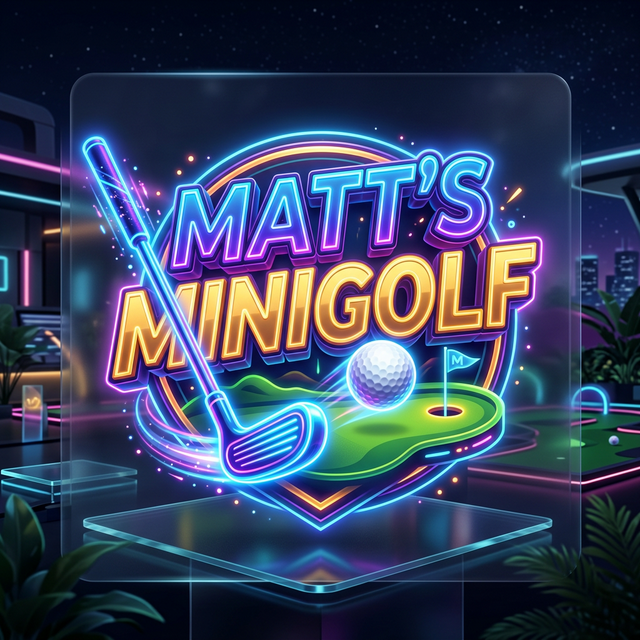

# ⛳ Matt's Minigolf

A premium, full-featured 18-hole mini-golf experience built with modern web technologies. Focus on high-fidelity aesthetics, custom physics, and modular course design.



## 🚀 Features

- **Standard 18-Hole Course**: Play through the full "Minigolf Meadows" course with a target par of 54.
- **Custom Physics Engine**: Responsive ball physics including:
    - **Friction & Momentum**: Realistic roll and stop mechanics.
    - **Collision Detection**: Advanced Circle-Rect and Circle-Line collision handling.
    - **Dynamic Obstacles**: Windmills (rotating), moving walls, bouncers, and boost ramps.
- **Modular Level System**: Every hole is defined in its own file (under `game/holes/`), making it simple to add or modify courses.
- **Safety & Stability**: 
    - **Impulse Capping**: Prevents ball tunneling through walls during high-speed collisions.
    - **Automatic Out-of-Bounds Detection**: Automatically resets the ball to the tee if it escapes the course.
- **Premium UI**: 
    - Stunning "Selection Screen" with course tiles and animated cards.
    - Glassmorphism overlay for the **ESC Pause Menu**.
    - Fully customizable ball colors.

## 🕹️ Controls

- **Aim & Shoot**: Click and drag away from the ball to set power and direction. Release to putt.
- **Pause Menu**: Press `ESC` during play to pause, reset the ball, or return to the main menu.
- **Navigation**: Use the mouse to navigate menus and select courses.

## 📁 Repository Structure

```text
/
├── index.html        # Entry point
├── styles.css        # Global premium UI styles
├── game/
│   ├── mini-golf.js  # Main game engine & physics
│   ├── logo.png      # Branding asset
│   ├── meadows.png   # Course preview asset
│   └── courses/      # Course-based organization
│       └── meadows/  # "Minigolf Meadows" course
│           ├── index.js  # Hole registry for this course
│           ├── utils.js  # Shared geometry helpers
│           └── hole1.js - hole18.js # Individual hole data
└── main.js           # Bootstrapper
```

## 🛠️ Technology Stack

- **Core**: Vanilla JavaScript (ES6+ Modules)
- **Rendering**: HTML5 Canvas API
- **Styling**: Modern Vanilla CSS (Flexbox, CSS Grid, Glassmorphism, Keyframe Animations)
- **Fonts**: Google Fonts (Outfit, Inter)

## 🏗️ Adding New Holes

Adding a hole is simple thanks to the modular architecture:
1. Create a new file in `game/courses/meadows/` (e.g., `hole19.js`).
2. Export a configuration object defining walls, obstacles, tee, and hole positions.
3. Register the new hole in `game/courses/meadows/index.js`.

---
*Created by Matt. Experience the ultimate putting adventure!*
